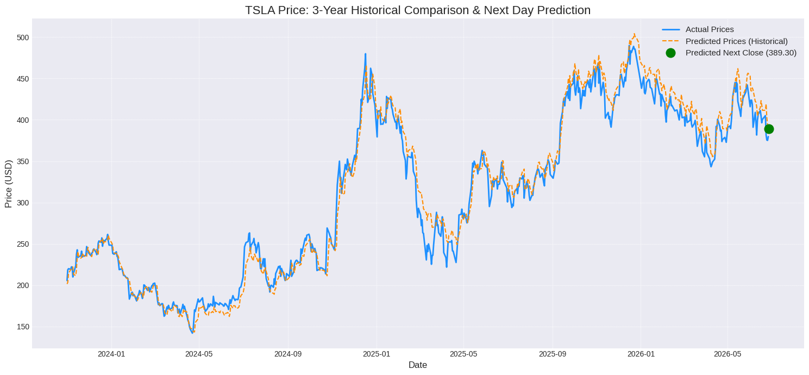
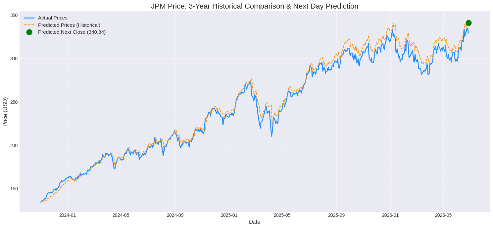

# Deep Learning Models for Financial Time-Series Forecasting

Forecasting the **next-day closing price** of stocks using three deep learning architectures and comparing them on an identical data pipeline:

1. **GRU-Transformer** — a GRU encoder feeding a Transformer encoder
2. **LSTM-Transformer** — an LSTM encoder feeding a Transformer encoder
3. **Transformer (standalone)** — a pure self-attention model with no recurrent layers

A single model is trained across **all seven stocks at once**. Each stock gets a learnable embedding, so one shared network specialises per ticker while still learning patterns common to all of them.

> ⚠️ **Disclaimer:** This project is for educational and research purposes only. Nothing here is financial advice, and these predictions should not be used to make trading or investment decisions.

---

## Table of Contents

- [Key Features](#key-features)
- [Models](#models)
- [Data Pipeline](#data-pipeline)
- [Evaluation Metrics](#evaluation-metrics)
- [Results](#results)
- [Project Structure](#project-structure)
- [Installation](#installation)
- [Usage](#usage)
- [Configuration](#configuration)
- [Future Work](#future-work)
- [License](#license)

---

## Key Features

- **Multi-stock training with stock embeddings** — one model handles all tickers; a learned `nn.Embedding` distinguishes each stock.
- **Technical-indicator feature engineering** — SMA, EMA, RSI, MACD, and Bollinger Bands added on top of OHLCV data.
- **Outlier removal** — daily returns are filtered with a rolling 252-day Z-score (|Z| ≤ 3) before training.
- **Reproducible** — fixed random seeds across NumPy and PyTorch (including CUDA/cuDNN deterministic mode).
- **Next-day prediction + visualization** — for each stock, the model plots 3 years of actual vs. predicted prices and marks the predicted next-day close.

## Models

All three models share the same input projection, positional encoding, and final linear head. They differ only in the encoder stage:

| Model | Architecture | Notebook |
|-------|--------------|----------|
| **GRU-Transformer** | Input projection → 2-layer GRU (dropout 0.1) → positional encoding → Transformer encoder → linear head | `GRU Transformer final.ipynb` |
| **LSTM-Transformer** | Input projection → 2-layer LSTM (dropout 0.1) → positional encoding → Transformer encoder → linear head | `LSTM Transformer final.ipynb` |
| **Transformer (standalone)** | Input projection → positional encoding → Transformer encoder → linear head (no recurrent layer) | `Transformer standalone final.ipynb` |

**Shared hyperparameters:** model dimension `128`, recurrent hidden size `128` (GRU/LSTM models), `8` attention heads, `3` Transformer encoder layers, stock embedding dimension `32`, GELU activation.

> Each model uses an `input_proj` linear layer that concatenates the input features with the stock embedding before encoding. The standalone Transformer applies positional encoding directly to the projected input; the hybrid models apply it to the recurrent layer's output.

## Data Pipeline

The same preprocessing is used across all three models:

- **Source:** Yahoo Finance via the `yfinance` library
- **Tickers:** `AAPL`, `MSFT`, `GOOGL`, `JPM`, `V`, `JNJ`, `TSLA`
- **Date range:** January 1, 2015 → today
- **Lookback window (`seq_len`):** 60 trading days
- **Target:** next-day scaled `Close` price
- **Base features:** Open, High, Low, Close, Volume
- **Engineered features:** `sma_10`, `ema_10`, `rsi` (14), `macd`, `bb_bbm` (Bollinger middle band), `day_of_week`
- **Outlier removal:** rows where the rolling 252-day Z-score of daily returns exceeds 3 (absolute) are dropped
- **Scaling:** `MinMaxScaler` (a separate close-price scaler per stock is kept for inverse-transforming predictions back to price)
- **Split:** sequences from all stocks are pooled, shuffled, and split 80% train / 20% test (≈15,390 train / 3,848 test sequences)

## Evaluation Metrics

Each model is evaluated on the held-out test set, with predictions inverse-scaled back to USD prices before scoring: R² (coefficient of determination), Explained Variance, MAE, RMSE, MAPE, and SMAPE.

## Results

Test-set performance (lower error is better; higher R² is better):

| Model | R² | Explained Var. | MAE | RMSE | MAPE | SMAPE |
|-------|-----|----------------|-----|------|------|-------|
| GRU-Transformer | 0.9887 | 0.9955 | 8.77 | 11.23 | 7.31% | 6.90% |
| LSTM-Transformer | _TODO_ | _TODO_ | _TODO_ | _TODO_ | _TODO_ | _TODO_ |
| **Transformer (standalone)** | **0.9931** | 0.9944 | **5.97** | **8.76** | **5.22%** | **5.47%** |


### Sample predictions

Three years of actual vs. predicted closing prices, with the predicted next-day close marked in green:




### Interpreting these numbers

The very high R² (≈ 0.99) should **not** be read as "the model predicts the market." It mainly reflects how easy it is to predict price *levels*: consecutive daily closes are nearly identical, so any model that roughly tracks the previous day's price already scores extremely well on R² and MAPE. In the plots, the predicted line slightly **lags** the actual line — the signature of a model leaning on day-to-day persistence rather than anticipating moves.

A few honest observations:

- **The simplest model wins.** The standalone Transformer beats the GRU-Transformer on every error metric (MAE 5.97 vs 8.77, RMSE 8.76 vs 11.23). Adding a recurrent encoder in front of the attention layers did not help here — attention plus positional encoding was enough.
- **GRU shows a slight bias.** Its Explained Variance (0.9955) sits noticeably above its R² (0.9887); that gap indicates a small systematic offset in its predictions, whereas the Transformer's two numbers are much closer (better-calibrated).
- **Predicting levels, not returns.** A naive "tomorrow = today" baseline scores a near-identical R² on price levels. The meaningful question is whether the model beats that baseline and predicts the *direction* of the next move better than chance (~50%) — both are listed under Future Work.
- **Shuffled split.** Sequences are pooled across stocks and shuffled before the 80/20 split, so test windows are interleaved in time with training windows. This leaks future information and inflates the metrics. A time-ordered (walk-forward) split is the correct evaluation for deployment.

These caveats are surfaced deliberately: on financial time series, an honest account of *why* a metric looks good matters more than the metric itself.

## Project Structure

```
Deep-Learning-Models-for-Financial-Time-Series-Forecasting/
├── GRU Transformer final.ipynb        # GRU-Transformer model
├── LSTM Transformer final.ipynb       # LSTM-Transformer model
├── Transformer standalone final.ipynb # Standalone Transformer model
├── results/                           # Saved prediction plots (.png)
├── requirements.txt
└── README.md
```

## Installation

```bash
git clone https://github.com/aayushML-tech/Deep-Learning-Models-for-Financial-Time-Series-Forecasting.git
cd Deep-Learning-Models-for-Financial-Time-Series-Forecasting
pip install -r requirements.txt
```

`requirements.txt`:

```
yfinance
torch
numpy
pandas
scikit-learn
matplotlib
ta
```

## Usage

Launch Jupyter and run any notebook's cells in order:

```bash
jupyter notebook
```

Each notebook will download and preprocess data for all seven tickers, train for 30 epochs, print test-set metrics, and generate a next-day prediction plus a 3-year comparison plot for every stock.

To predict a single stock, call the helper defined in each notebook:

```python
predict_next_day("AAPL")
```

Only the seven trained tickers are supported; any other symbol returns an error message.

## Configuration

| Setting | Value | Where |
|---------|-------|-------|
| Tickers | 7 large-cap stocks | `tickers` list |
| Lookback window | 60 days | `seq_len` |
| Train/test split | 80 / 20 | `train_size` |
| Batch size | 64 | `DataLoader` |
| Optimizer | Adam, lr = 5e-4 | `optimizer` |
| LR scheduler | StepLR, gamma 0.5 (step 10 for GRU/LSTM, 15 for Transformer) | `scheduler` |
| Epochs | 30 | `epochs` |
| Loss | MSE | `criterion` |
| Gradient clipping | max-norm 1.0 | training loop |

To experiment, edit the `tickers` list, `seq_len`, or the model arguments (`model_dim`, `n_heads`, `num_layers`, `embedding_dim`).

## Future Work

- **Add a naive baseline** ("tomorrow = today") and report it alongside the models, so the metrics have a reference point.
- **Report directional accuracy** (% of correct up/down calls) — the metric that actually matters for trading.
- **Walk-forward / time-ordered validation** instead of a shuffled split, to remove look-ahead leakage.
- **Predict returns instead of price levels** to avoid the autocorrelation inflating R².
- Multi-step (multi-day horizon) forecasting; macro/sentiment features; hyperparameter tuning and an ensemble of the three encoders.


